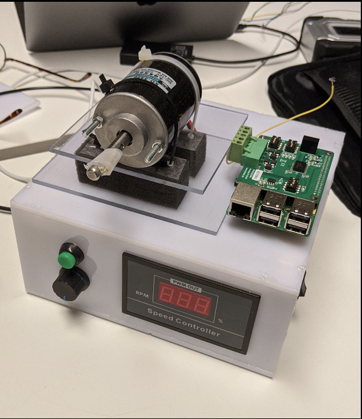
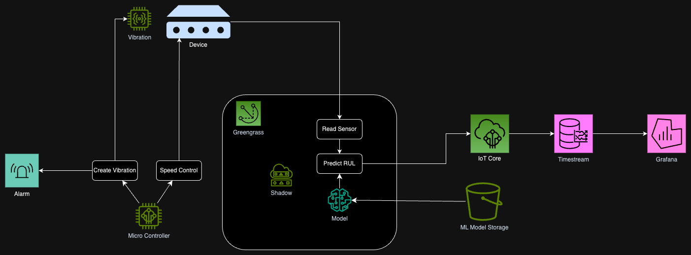
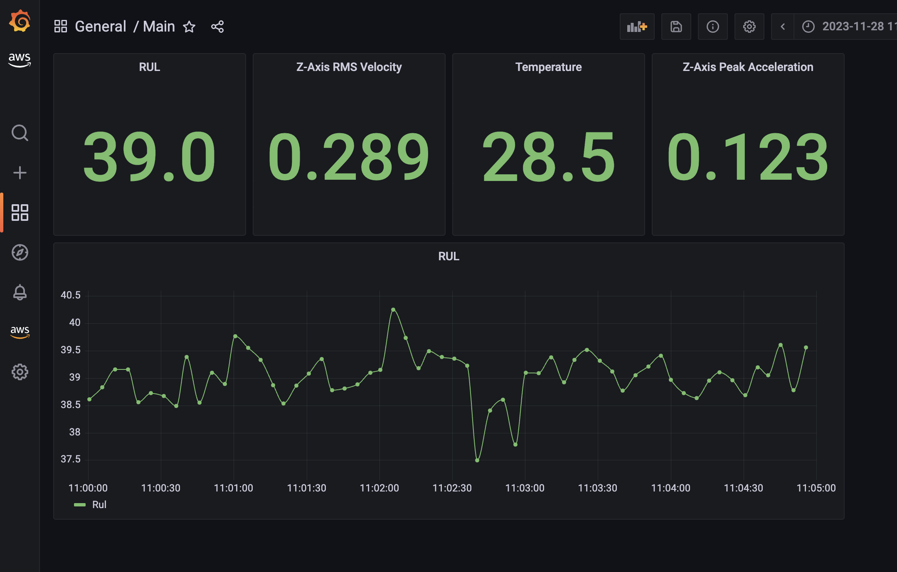

# Predictive Maintenance Demonstrator

A predictive maintenance demo using a speed controlled motor setup to predict failures before they happen, using data and machine learning. It gathers data from sensors, uses advanced algorithms to forecast problems, and provides actionable insights through visualizations. Ultimately, it shows how predictive maintenance can prevent breakdowns and optimize equipment performance.



## Architecture



## Building

To build the physical demo, please take a look go to [BuildSpec.md](./doc/BuildSpec.md) for list of materials.

## Deployment

The project is built using CDK IaC. So it can be deployed to your AWS account with a single deploy command.

### Pre-requisites

- Ensure your AWS credentials are in place for your account
- Ensure you have [Node.js](https://nodejs.org) and [Docker](https://www.docker.com/products/docker-desktop/) installed
- Bootstrap your account:
  In the root folder, run the following commands

  ```
  npm ci
  npm run cdk bootstrap -- --toolkit-stack-name CDKToolkit-Predictive-Maintenance --qualifier predmaint
  ```

### Generate Ml Model:

1. Run the Jupiter NoteBook located in [lib/ml](./lib/ml) to train the model with the example dataset provided. Feel free to run locally if you have a Jupiter instance or use a Notebook Instance in your AWS account (Guide [here](https://docs.aws.amazon.com/sagemaker/latest/dg/gs-console.html)).
1. After you finish running the notebook a trained model is created by the default name `lstm.h5`
1. Go to your AWS account, create a s3 bucket and upload the model
1. keep note of bucket name and filename, as we will pass that to the cdk code later.

### Follow steps below:

1. Clone this repo.
1. in your AWS Account [enable AWS IAM Identity Center and create a user for yourself](https://console.aws.amazon.com/singlesignon/identity/home)
1. Go to [ckd.json](./cdk.json) and update the `mlBucketPath` field with your ml bucket details you created earlier.
1. In the root folder, run the following commands
   ```
   npm run deploy
   ```
1. For any future changes you just need to redeploy using `npm run deploy`

## Setup the RaspberryPI

This steps assume you have an SD Card and Raspberry PI

1. Install Raspeberry Pi OS Lite (64-bit) on a SD card:
   1. Download [Raspberry Pi Imager](https://www.raspberrypi.com/software/)
   1. Launch the imager
   1. Select the right image: `Raspeberry Pi OS (other)` > `Raspeberry Pi OS Lite (64-bit)`
   1. Select the right drive
   1. Set up a the **Wifi** (you can create a hotspot with your phone for instance) and **ssh credentials** by clicking on the _gear_ on the bottom right:
      1. Check `Enable SSH`
      1. Set username and password
      1. Check `Configure Wireless LAN` (This connection will help you connect to the pi from your computer after the first boot)
      1. Set Wifi `SSID` and `Password`
      1. Save
   1. Click `Write` button to write the image to the SD card
1. Connect to your Raspberry Pi:
   1. Start your Raspberry Pi with SD Card plugged in it
   1. SSH to it by connecting your PC to the network you set up in the previous steps (`ssh pi@raspberrypi.local`)
1. Setup up Raspberry Pi:
   1. Configure the interface options:
      1. run `raspi-config`
      1. Go to Interface options
      1. Enable I4, I5, I6 (enable Hardware Serial port only, not login shell), I7 and I8
      1. Reboot your PI !
   1. Install Java and pip3 using apt
      ```
      sudo apt-get update
      sudo apt-get install default-jre python3-pip docker.io
      ```
   1. Create ggc_user and give it permission to access serial port and GPIO
      ```
      useradd ggc_user && sudo groupadd ggc_group && sudo usermod -aG ggc_group ggc_user && sudo usermod -a -G dialout ggc_user && sudo usermod -a -G gpio ggc_user
      ```
   1. Install Greengrass running the following command
      ```
      curl -s https://d2s8p88vqu9w66.cloudfront.net/releases/greengrass-nucleus-latest.zip > greengrass-nucleus-latest.zip && unzip greengrass-nucleus-latest.zip -d GreengrassInstaller
      ```
   1. Register your PI to your backend
      1. The Greengrass installer uses AWS credentials to provision the AWS resources that it requires. You can provide credentials as environment variables. Copy the command below to your device’s terminal. Replace the text after the ‘=’ sign with the specified information. [Learn more](https://docs.aws.amazon.com/console/greengrass/v2/configure-aws-credentials)
         ```
         export AWS_ACCESS_KEY_ID=<AWS_ACCESS_KEY_ID>
         export AWS_SECRET_ACCESS_KEY=<AWS_SECRET_ACCESS_KEY>
         export AWS_SESSION_TOKEN=<AWS_SESSION_TOKEN>
         ```
      1. Run the command given as output of your backend deployment (aka. `npm run deploy`). Something like `sudo -E java -Droot="/greengrass/v2" ...`
1. Check the device is registered in your account:
   1. Go to AWS IOT Core console > Greengrass devices > Core devices > `PredictiveMaintenanceDemoStack-Thing` > Deployments
   1. Check the deployments are `Completed`

You are all set !

## Grafana Dashboard

To see everything in action, we can login to Grafana and checkout our Dashboard to view watertank digital twin and all the metrics.
After deployment the url for our grafana instance will be printed out in your command line or you could get the url from your AWS console by visiting the Managed Grafana service page, however you won't have access yet.
AWS Managed Grafana is using AWS IAM Identity Center for Authorisation previously known as AWS Single Sign-On (SSO).

You should have an IAM Identity User created by now, so we need to give it permission to access our Grafana Instance.

1. Login to your console and visit the Managed Grafana servie page.
1. Go to the grafana workspace created by our deployment.
1. In the Authentication tab, click on `Configure users and user groups`
1. Add your IAM Identity User

Now you are ready to visit grafana dashboard.ra

1. Just visit the grafana url either printed in your terminal or diplayed in your console under Grafana workspace Url.
1. login using your IAM Identity User credentials
1. Visit the dashboard section, choose browse and you can view the dashboard created by our deployment as seen below.

   

## Greengrass component changes

To deploy any changes in greengrass components, make sure you upgrade the componenent version in [cdk.json](./cdk.json), before running `npm run deploy` again

## Clean up

To remove all resources created by this stack run the following

```
npm run destroy
```

## Security

See [CONTRIBUTING](CONTRIBUTING.md#security-issue-notifications) for more information.

## License

This library is licensed under the MIT-0 License. See the LICENSE file.
